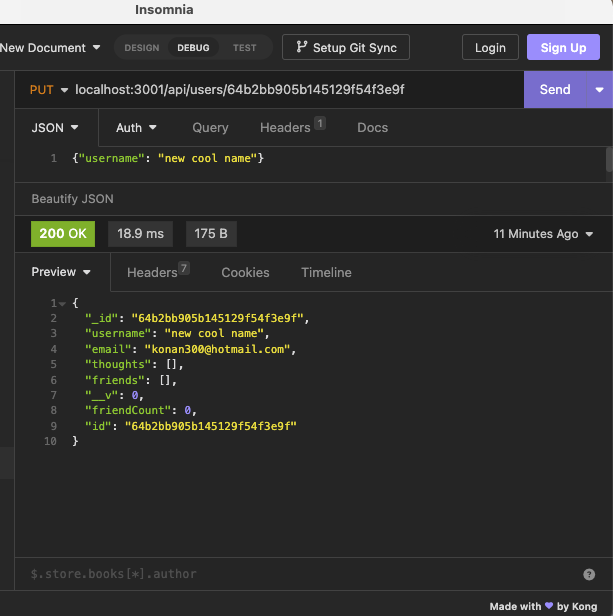

# ThoughtsWithFriends

## Description:

 Thoughts With Friend is an API for a social network web application where users can share their thoughts, react to friends’ thoughts, and create a friend list. Express.js is used for routing, along with a MongoDB database, and the Mongoose ODM. 

## Table of Contents

- [Description](#description)
- [Installation](#installation)
- [Usage](#usage)
- [Demonstration](#demonstration)
- [Contributions](#contributions)
- [Links](#links)
- [License](#license)

## Installation:
1. Clone this repository to your local machine.

2. Install the required dependencies using the following command:

    npm install mongoose

3. Set up your MongoDB database by opening Mongo DB Compass and create a new connection

4. Start the application by running the following command:

    node server.js

5.  Using insomnia or your browser, view:

- localhost:3001/api/users
- localhost:3001/api/users/userID
- localhost:3001/api/users/userID/friends
- localhost:3001/api/users/userID/friends/friendID
- localhost:3001/api/thoughts
- localhost:3001/api/thoughts/thoughtID
- localhost:3001/api/thoughts/thoughtID/reactions
- localhost:3001/api/thoughts/thoughtID/reactions/:reactionID

## Usage:

After you have followed the steps in [Installation](#installation):

**Interface**: Thought With Friends runs in the browser or applications like Insomnia that are designed to design, debug or test API's. To 

**id search**: if you are looking for a specific user, thought or reaction, add the id number to the end of your search. For example:
- localhost:3001/api/users/1
- localhost:3001/api/thoughts/3

## Demonstration:

Uploading ThoughtsWFriends.mov…

### User Routes

1. **GET All Users** localhost:3001/api/users/

2. **GET Single User** localhost:3001/api/users/userId

3. **POST New User** localhost:3001/api/users/
'Body JSON:
{
	"username": "username",
		"email": "email"
}'

4. **PUT Update User** localhost:3001/api/users/userId
'Body JSON:
{"username": "new cool name"}'

5. **DELETE Single User** localhost:3001/api/users/userId

6. **POST Add Friend**localhost:3001/api/users/userId/friends/
'Body JSON:
{"friends": "friendId"}'

6. **DELETE Remove Friend**localhost:3001/api/users/userId/friends/friendId

### Thought Routes

1. **GET All Thoughts** localhost:3001/api/thoughts/

2. **GET Single Thought** localhost:3001/api/users/thoughtId

3. **POST New Thought** localhost:3001/api/thoughts/
'Body JSON:
{
	"username":"username",
	"thoughtText": "this is my new thought",
	"userId": "userId"	
}'

4. **PUT Update Thought** localhost:3001/api/thoughts/thoughtId
'Body JSON:
{
		"username":"username",
	"thoughtText": "this is my UPDATED thought",
	"userId": "userId"
}'

5. **DELETE Single Thought** localhost:3001/api/thoughts/thoughtId

6. **POST Add Reaction**localhost:3001/api/thoughts/thoughtId/reactions/
'Body JSON
{"reactionBody": "this is where you react",
"username" :"username"}'

6. **DELETE Remove Reaction**localhost:3001/api/thoughts/thoughtId/reactions/reactionId

## Contributions: 

Contributions to ComCore are welcome! If you have any improvements, bug fixes, or new features to add, feel free to submit a pull request.

To contribute to Thoughts With Friends, please follow these steps:

1. Fork the repository.
2. Create a new branch for your feature or bug fix.
3. Make your changes in the new branch.
4. Commit your changes, providing a descriptive commit message.
5. Push your branch to your forked repository.
6. Open a pull request against the main repository.
7. Provide a clear and concise description of your changes in the pull request.
8. Submit the pull request and wait for feedback or further instructions.

Please note that by submitting a pull request, you agree to allow the project maintainers to license your work under the project's existing license.

Thank you for considering contributing to Thoughts With Friends. Your contributions are highly appreciated!

## Links: 
- Repository: https://github.com/kemcclen/ThoughtsWithFriends

## License:
Thoughts With Friends is licensed under the [MIT License](https://opensource.org/license/mit/).

_The MIT License is a permissive open-source license that allows you to use, modify, and distribute the project for both commercial and non-commercial purposes. It provides you with the freedom to customize the application to suit your needs._

_By contributing to ComCore, you agree that your contributions will be licensed under the same MIT License. This ensures that the project remains open-source and accessible to the community._
